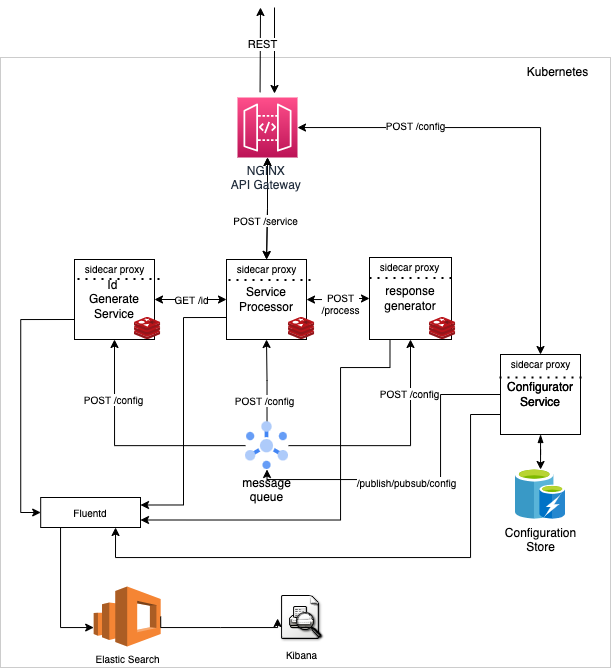
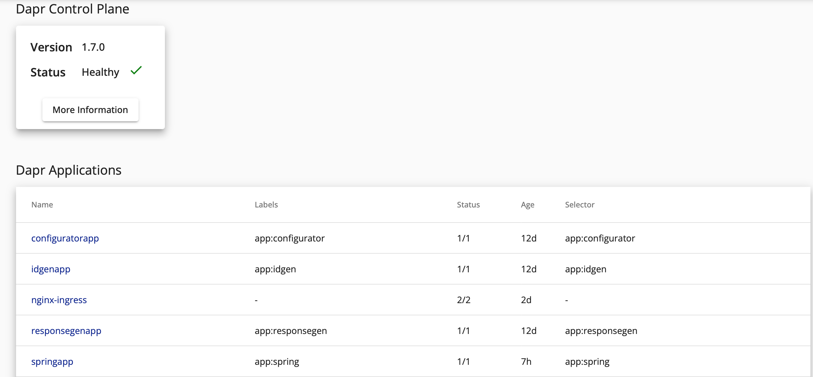

# DAPR-SIMULATOR



## Project information

- The version of programming languages

| Attribute                   | Details |
|-----------------------------|---------|
| Dapr runtime version        | v1.7.0  |
| Dapr CLI version            | v1.6.0  |
| Java version                | Java 11 |

- The API of services

| Service Name                   | Endpoint | Method |
|-----------------------------|---------|---------|
| Serviceapp                     | /service  | GET|
| configurator            		 | /config | POST|

## Install DAPR in Kuberenetes 

Refer to https://docs.dapr.io/operations/hosting/kubernetes/kubernetes-deploy/

## Run the Dapr sidecar in K8S
- Check status of Dapr services from Kubernetes
```bash
dapr status -k
```

All services should show True in the HEALTHY column and Running in the STATUS column
```bash
  NAME                   NAMESPACE    HEALTHY  STATUS   REPLICAS  VERSION  AGE  CREATED              
  dapr-sentry            dapr-system  True     Running  1         1.7.0    23d  2022-04-19 17:11.17  
  dapr-sidecar-injector  dapr-system  True     Running  1         1.7.0    23d  2022-04-19 17:11.17  
  dapr-operator          dapr-system  True     Running  1         1.7.0    23d  2022-04-19 17:11.17  
  dapr-placement-server  dapr-system  True     Running  1         1.7.0    23d  2022-04-19 17:11.19  
 ```

 - Run Dashboard

 ``` bash 
 dapr dashboard -k -p 9999
 ```

- Install Redis for pubsub

helm repo add bitnami https://charts.bitnami.com/bitnami
helm install -n redis staging bitnami/redis-cluster

- Install Mongo DB for logs collection 
helm install my-release bitnami/mongodb

- Build Services

docker-compose build --pull
docker-compose push

- Run App on K8S

kubectl apply -f ../k8s-deployment/


## API Gateway

The Simulator uses three APIs internally. In production, the number of APIs could substantially increase in real time. The app uses Nginx Ingress controller configured with a Sidecar and routing rules to route the API by an ingress config file.
Follow below steps to configure gateway from the k8s-deployment folder

```bash 
helm install nginx-ingress ingress-nginx/ingress-nginx -f dapr-annotations.yaml --set controller.replicaCount=2
```

Validate the nginx controller are configured

```bash
kubectl get pods
```
Configure the ingress rules

``` bash
kubectl create -f ingress.yaml
```

## Controller Advice

The APIs are built with springboot/JAVA and uses controller advice to cater to exception handling. Controller Advice is a springboot feature which is an extension of component and intercept the exception generated from anywhere in the application and standardize the response as per interface to provide a bettwe user experience.

## Hystrix

DAPR supports Netflix's hystrix as a popular circuit breaker framework. It provides a handle on the latency and downstream systems failure. 



